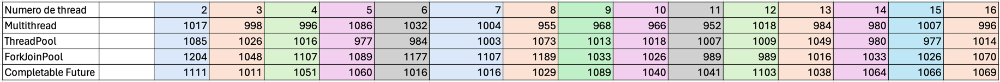

# Parallel Digital Image Processing and Analysis - SISMD 2023/2024

- Bruno Santos - 1230170
- David Magalhães - 1201237
- Pedro Pacheco - 1181034
- Vera Pinto - 1180730

## Implementação

#### Brightness

1. **Sequential** - 

   O método BrighterFilter aumenta o brilho de cada pixel da imagem. Este algoritmo percorre cada pixel da imagem, aumenta os valores de vermelho (red), verde (green) e azul (blue) por um valor definido, mas sem exceder o máximo de 255 para cada cor. Se o aumento proposto para qualquer cor ultrapassar 255, essa cor é definida como 255. Depois de ajustar as cores, o pixel é atualizado na imagem temporária.

2. **Multi-threaded** - 

   O método BrighterFilterMultiThread aplica um filtro para tornar uma imagem mais brilhante utilizando múltiplas threads para processar diferentes 	partes da imagem simultaneamente, melhorando a eficiência do processamento. A imagem é dividida horizontalmente em partes iguais, com cada 	thread responsável por aumentar o brilho de uma parte específica. As threads são iniciadas para processar suas respectivas secções e, após todas 	as threads terem concluído o processamento (usando join para sincronização).

3. **Thread-Pool**

   1. **Executor** - 

      O método BrighterFilterThreadPool aplica um filtro para aumentar o brilho de uma imagem usando uma pool de threads para processamento paralelo, o que melhora a eficiência, especialmente em imagens grandes. Este método divide a imagem em faixas horizontais, onde cada thread em um pool fixo processa uma faixa, aumentando o brilho de cada pixel na faixa designada.

      A divisão é feita de modo que todas as threads tenham aproximadamente a mesma quantidade de trabalho, distribuindo as linhas restantes pelas primeiras threads caso a divisão não seja exata. Após submeter todas as tarefas ao executor, o método espera que todas as threads terminem usando *awaitTermination*.
   2. **Fork Join Pool**
      Esse algoritimo executa de maneira recursiva. 
      É criado um ForkJoinPool com um número específico de threads para processar a imagem de forma paralela. 
      O método invoke é utilizado para executar uma tarefa ForkJoinPool que processa o filtro de brilho em toda a imagem.
      A classe BrightnessFilterForkJoinPoolTask implementa a interface RecursiveAction e é responsável por realizar o processamento do filtro de brilho em uma parte da imagem. 
      Ela divide o trabalho em duas tarefas menores até que esse tamanho seja uma linha da imagem. 

   3. **Completable Futures**
      Nessa solução o trabalho é dividido em seções (chunks) verticais, cada uma atribuída a uma thread separada. 
      Cada thread processa suas seções de forma independente, aplicando o filtro de brilho aos pixels da imagem. 
      O uso de CompletableFuture permite que as tarefas sejam executadas em paralelo, melhorando o desempenho do processo.
      O método `allOfFuture.get()` é chamado para aguardar o fim da execução de todas as threads.

#### Grayscale

1. **Sequential** - 
 O filtro de escala de cinza, implementado no método GrayScaleFilter, converte uma imagem colorida em tons de cinza. Isso é feito calculando a média dos valores de vermelho, verde e azul para cada pixel e, em seguida, definindo os componentes de cor do pixel para esse valor médio.

2. **Multi-threaded** -
   Determina-se o número de linhas que cada thread deveria processar. Isso foi feito dividindo a altura da imagem pelo número de threads e armazena-se o resultado na variável rowsPerThread. As linhas restantes foram distribuídas entre as threads.  
   Em seguida, cria-se um array de threads e inicia-se cada thread para processar uma secção específica da imagem. Cada thread foi criada com uma instância da classe GrayFilterThread, que foi passada a imagem original, as linhas de início e fim que a thread deveria processar.  
   Depois que todas as threads foram iniciadas, utiliza-se o método join para esperar que todas as threads terminassem de processar as suas respectivas secções da imagem.  
   No fim, escreve-se a imagem processada em um arquivo usando a função Utils.writeImage.

3. **Thread-Pool**
   1. **Executor** -
      Determina-se o número de linhas que cada tarefa deveria processar. Isso foi feito dividindo a altura da imagem pelo número de threads e armazenando o resultado na variável rowsPerTask. As linhas restantes foram distribuídas entre as tarefas.  
      Em seguida, cria-se um ExecutorService com um número fixo de threads.  
      Depois, para cada thread, submete-se uma nova tarefa ao ExecutorService. Cada tarefa foi criada com uma instância da classe GrayFilterTask, que foi passada a imagem original, as linhas de início e fim que a tarefa deveria processar.
      Na classe GrayFilterTask, o método run() aplica o filtro de escala de cinza a cada pixel da imagem à secção de linhas que a tarefa deveria processar.
      Após todas as tarefas terem sido submetidas, desliga-se o ExecutorService e aguarda-se a conclusão de todas as tarefas.
      No fim, escreve-se a imagem processada em um arquivo usando a função Utils.writeImage.

   2. **Fork Join Pool** -
      Cria-se uma nova instância de ForkJoinPool com um número específico de threads.  
      Em seguida, você cria-se uma nova tarefa GrayFilterForkJoinPoolTask, que foi passada a imagem original, a imagem de destino, e as linhas de início e fim que a tarefa deveria processar.  
      Como a classe GrayFilterForkJoinPoolTask estende RecursiveAction, a tarefa é dividida em sub-tarefas menores até que o tamanho da tarefa seja menor que um valor específico.
      Depois, submete-se a tarefa ao ForkJoinPool usando o método invoke.  
      Finalmente, escreve-se a imagem processada em um arquivo usando a função Utils.writeImage.

   3. **Completable Futures** -
      Cria-se um ExecutorService com um número fixo de threads.  
      Em seguida, para cada thread, submete-se uma nova tarefa ao ExecutorService. Cada tarefa foi criada com uma instância da classe GrayCompletableFuturesTask, que foi passada a imagem original, as linhas de início e fim que a tarefa deveria processar.
      Na classe GrayCompletableFuturesTask, o método call() aplica o filtro cinza à secção da imagem que foi atríbuida à tarefa e retorna um CompletableFuture contendo a imagem processada.
      Depois que todas as tarefas foram submetidas, aguarda-se a conclusão de todas as tarefas usando o método get de cada CompletableFuture.  
      Finalmente, escreve-se a imagem processada em um arquivo usando a função Utils.writeImage.

#### Swirl

1. **Sequential**
   O código começa determinando as dimensões da imagem, ou seja, sua altura e largura. 
   Em seguida, são calculadas as coordenadas do centro da imagem, que serão usadas como base para o filtro swirl. 
   Além disso, é definido o ângulo máximo de rotação, representado por "maxAngle" que será aplicado com base na distância do pixel ao centro da imagem.
   
   Em seguida, é criada uma matriz para armazenar a imagem filtrada, com as mesmas dimensões da imagem original.
   
   O código itera sobre cada pixel da imagem. Para cada pixel, calcula-se a distância entre o pixel e o centro da imagem usando a fórmula da distância. 
   Com base nessa distância, calcula-se o ângulo de rotação multiplicando a distância pelo ângulo máximo
   
   Usando o ângulo calculado, são calculadas as novas coordenadas do pixel após a aplicação do filtro swirl. 
   Isso é feito usando as fórmulas de transformação mencionadas na documentaçaão do projeto.

3. **Multi-threaded**
   O código cria várias threads para processar a imagem em paralelo. 
   Cada thread é responsável por uma parte da imagem, dividida igualmente com base no número de threads especificado.
   Caso nao seja possível dividir igualitariamente, a última thread assume a porção excedente da imagem.
   Para cada parte da imagem atribuída a uma thread, o código itera sobre cada pixel e aplica a transformação descrita anteriormente.
3. **Thread-Pool**
   1. **Executor**
      Muito semelhante aos anteriores onde cada thread é responsável por uma parte específica da imagem, e o filtro de distorção é aplicado. 
      O que diferencia essa implementaçao é que o código utiliza um ExecutorService para gerenciar o pool de threads e aguarda a conclusão do processamento antes de continuar.
      Nesse caso, nao sendo necessário criar e dar start nas threads e nem fazer o join do trabalho.
   2. **Fork Join Pool**
      Nesse caso, tambeém existe divisao das tarefas.
      Cada thread é responsável por processar uma parte específica da imagem.
      A classe `SwirlFilterForkJoinPoolTask` representa uma tarefa recursiva que aplica o filtro de distorção a uma parte da imagem.
      Essa parte foi definica como sendo a linha de pixeis da imagem. 
      Enquanto for possível dividir a imagem, novos empilhamentos de execução são criados e invocados recursivamente.
   3. **Completable Futures**
      Esse algoritimo por sua vez executa de forma assíncrona usando CompletableFuture. 
      Ele começa definindo as dimensões da imagem e os parâmetros do filtro como todos os outros. 
      Para cada parte da imagem atribuída a uma tarefa, é criado um CompletableFuture que executa de maneira assíncrona para processar cada pixel (a mesma divisão aqui foi explicada no tópico de Miltithreads).
      Após a criação de todas as tarefas, a conclusão de todas elas é esperada atraveés do método allOf(). 
      Uma vez que todas as tarefas estejam concluídas, a imagem filtrada é escrita em um arquivo.

#### Glass

1. **Sequential** -
   Cria-se uma cópia da imagem original para armazenar a imagem processada.  
   Em seguida, percorre-se cada pixel da imagem original. Para cada pixel, calcula-se um deslocamento aleatório dentro de um raio especificado (5 pixeis).  
   Substituiu-se o pixel original pelo pixel deslocado na imagem copiada.  
   Finalmente, escreve-se a imagem processada num arquivo.

2. **Multi-threaded** -
   Cria-se uma cópia da imagem original para armazenar a imagem processada.  
   Em seguida, dividi-se a imagem em várias secções, cada uma processada por uma thread separada.  
   Para cada thread, percorre cada pixel na secção atribuída a essa thread. Para cada pixel, calcula um deslocamento aleatório dentro de um raio especificado (5 pixeis).  
   Substituiu-se o pixel original pelo pixel deslocado na imagem copiada.  
   Finalmente, espera-se que todas as threads terminem e escreve a imagem processada num arquivo.

3. **Thread-Pool**
   1. **Executor** -
      Cria um ExecutorService com um número fixo de threads igual ao número de núcleos de CPU disponíveis.  
      Divide a imagem em várias secções, cada uma processada por uma tarefa separada. Cada tarefa foi responsável por aplicar o filtro de vidro a uma secção específica da imagem.  
      Submete todas as tarefas ao ExecutorService. Cada tarefa foi executada por uma thread do pool de threads.  
      Usa o método shutdown do ExecutorService para iniciar um desligamento ordenado, no qual as tarefas previamente submetidas são executadas, mas não são aceites novas tarefas. Em seguida, chama o método awaitTermination para bloquear até que todas as tarefas tenham concluído a execução após um pedido de desligar.  
      Escreve a imagem processada em um arquivo.
   
   2. **Fork Join Pool** -
      Cria um ForkJoinPool com um número fixo de threads igual ao número de núcleos de CPU disponíveis.  
      Cria uma tarefa GlassFilterForkJoinPoolTask que processa toda a imagem. Se a imagem era grande demais para ser processada eficientemente por uma única tarefa, divide a tarefa em duas tarefas menores para processaram metade da imagem cada uma.  
      Submete a tarefa ao ForkJoinPool. A tarefa foi executada por uma thread do pool de threads.  
      Usa o método invoke do ForkJoinPool para iniciar a execução da tarefa e esperar até que ela fosse concluída.  
      Por fim, escreve a imagem processada em um arquivo.
   
   3. **Completable Futures** -
      Cria um ExecutorService com um número fixo de threads igual ao número de núcleos de CPU disponíveis.  
      Divide a imagem em várias seções, cada uma processada por uma tarefa separada. Cada tarefa foi responsável por aplicar o filtro de vidro a uma seção específica da imagem.  
      Submete todas as tarefas ao ExecutorService. Cada tarefa foi executada por uma thread do pool de threads.  
      Usa o método allOf do CompletableFuture para criar um CompletableFuture que é concluído quando todas as tarefas são concluídas. Em seguida, o método join é chamado para bloquear até que todas as tarefas tenham concluído a execução.  
      Por fim, escreve a imagem processada em um arquivo.

#### Blur

1. **Sequential** - 

   Para cada pixel da imagem, ele calcula uma média dos valores de vermelho, verde e azul dos pixels vizinhos, incluindo o próprio pixel, numa submatriz de tamanho definido por *matrixSize*. Este tamanho determina quão longe de cada pixel a média deve considerar, criando um efeito de desfoque ao "misturar" os valores de cores dos pixels adjacentes.

   O método percorre todos os pixels da imagem, utilizando um deslocamento (offset) para definir a área da submatriz centrada em cada pixel. Os novos valores médios de cor calculados substituem os originais, resultando numa imagem desfocada.
   
2. **Multi-threaded** - 
   O método BlurFilterMultiThread aplica um filtro numa imagem utilizando múltiplas *threads* para processar de forma paralela e aumentar a eficiência. Cada thread é responsável por desfocar uma parte específica. A imagem é dividida em segmentos horizontais, e cada segmento é processado por uma *thread* diferente. O número de linhas que cada thread processa é calculado para distribuir as linhas da imagem de maneira igualitária entre as *threads*. Após iniciar todas as *threads*, o método espera que todas terminem sua execução usando o método *join()*.

3. **Thread-Pool**

   1. **Executor** - 

      O método BlurFilterThreadPool usa um pool de threads para aplicar um filtro de desfoque a uma imagem, melhorando a eficiência para imagens grandes ou para sistemas com múltiplos processadores. A imagem é dividida em várias partes, cada uma sendo processada em paralelo por diferentes threads. A quantidade de tarefas é determinada pelo tamanho da imagem e pelo número de threads, ajustando para que cada tarefa tenha um trabalho significativo mas não muito pequeno (mínimo de 10000 pixels por tarefa).

      Cada tarefa é responsável por aplicar o desfoque em uma faixa horizontal específica da imagem, calculada com base na altura total da imagem e no número de tarefas. Depois de iniciar todas as tarefas, o método espera que todas terminem usando awaitTermination.
      
   2. **Fork Join Pool** - 
   
      O método BlurFilterForkJoinPool utiliza a estrutura ForkJoinPool para aplicar um filtro de desfoque a uma imagem de maneira eficiente e paralela. A imagem é processada dividindo-a em sub-regiões menores, que são então atribuídas a diferentes threads gerenciadas pelo ForkJoinPool. Cada thread trabalha em uma seção da imagem, aplicando o filtro de desfoque, e esse processo é feito de maneira recursiva até que as seções atinjam um tamanho de limite (THRESHOLD), momento em que o filtro é aplicado diretamente.
   
      A classe BlurFilterForkJoinPoolTask, que estende RecursiveAction, é responsável por essa divisão e pelo processamento do filtro. Se a área a ser processada é pequena o suficiente (menor que o THRESHOLD), o filtro é aplicado diretamente. Caso contrário, a tarefa é dividida em quatro sub-tarefas, processando cada quadrante da área de forma recursiva.
      
   3. **Completable Futures** - 

      O método BlurFilterCompletableFuture utiliza o CompletableFuture para aplicar um filtro de desfoque (blur) em uma imagem de forma assíncrona e paralela. A imagem é dividida verticalmente em segmentos com base no número de threads especificado. Cada CompletableFuture é responsável por desfocar uma coluna específica da imagem, desde o início até o fim da altura, utilizando uma largura de segmento definida.
      
      Este processo é realizado de forma assíncrona, permitindo que várias partes da imagem sejam processadas simultaneamente. Após iniciar todas as tarefas assíncronas, o método aguarda a conclusão de todas elas com CompletableFuture.allOf(futures).join(), garantindo que todas as partes tenham sido processadas antes de prosseguir.
      

#### Conditional Blur

1. Sequential
2. Multithreaded
3. Thread-Pool
   1. Executor
   2. Fork Join Pool
   3. Completable Futures

## Resultados

### City.jpg

#### Brightness

O processador utilizado para testar esta implementação é um Apple M1 Pro 10‑core.

 
1. **Sequential**

| Resultados | Time 1 (ms) | Time 2 (ms) | Time 3 (ms) | Average Time (ms) |
|------------|-------------|-------------|-------------|-------------------|
| City       | 1147        | 1169        | 1150        | 1155              |

2. **Multithreaded and Thread-Pool**

Todos os tempos são resultantes de uma média de três execuções.

#### Grayscale

1. **Sequencial** -

   | Resultados | Time 1 (ms) | Time 2 (ms) | Time 3 (ms) | Average Time (ms) |
   |------------|-------------|-------------|-------------|-------------------|
   | City       | 1955        | 1881        | 1982        | 1939,33           |

2. **Multithreaded and Thread-Pool** -

O processador utilizado para testar esta implementação é AMD Ryzen 7 5800H with Radeon Graphics com 8 cores e 16 threads.
Todos os tempos são resultantes de uma média de três execuções.

#### Swirl

O processador utilizado para testar esta implementação é um Apple M1 Pro 10‑core.

 
1. **Sequential**

| Resultados | Time 1 (ms) | Time 2 (ms) | Time 3 (ms) | Average Time (ms) |
|------------|-------------|-------------|-------------|-------------------|
| City       | 2269        | 2278        | 2328        | 2291              |

2. **Multithreaded and Thread-Pool**

Todos os tempos são resultantes de uma média de três execuções.

#### Glass

1. **Sequencial** - 

| Resultados | Time 1 (ms) | Time 2 (ms) | Time 3 (ms) | Average Time (ms) |
|------------|-------------|-------------|-------------|-------------------|
| City       | 1955        | 1881        | 1982        | 1939,33           |

2. **Multithreaded and Thread-Pool** - 

O processador utilizado para testar esta implementação é AMD Ryzen 7 5800H with Radeon Graphics com 8 cores e 16 threads.
Todos os tempos são resultantes de uma média de três execuções.

#### Blur

O processador utilizado para testar esta implementação é um 10th Generation Intel® Core™ Core i7-10750H Processor com 6 cores e 12 threads.

 

1. **Sequential**
| Resultados | Time 1 (ms) | Time 2 (ms) | Time 3 (ms) | Average Time (ms) |
|------------|-------------|-------------|-------------|-------------------|
| City       | 2697        | 2705        | 2750        | 2717              |

2. **Multithreaded and Thread-Pool**

Todos os tempos são resultantes de uma média de três execuções.

#### Conditional Blur

processor: AMD Ryzen 7 3700U with Radeon Vega Mobile Gfx, 2.30 GHz.

 

1. **Sequential**

| Resultados | Time 1 (ms) | Time 2 (ms) | Time 3 (ms) | Average Time (ms) |
|------------|-------------|-------------|-------------|-------------------|
| City       | 3606        | 2986        | 2947        | 3179              |

2. **Multithreaded and Thread-Pool**

Todos os tempos são resultantes de uma média de três execuções.

### Tree.jpg

#### Brightness

O processador utilizado para testar esta implementação é um Apple M1 Pro 10‑core.

 
1. **Sequential**

| Resultados | Time 1 (ms) | Time 2 (ms) | Time 3 (ms) | Average Time (ms) |
|------------|------------|-------------|-------------|-------------------|
| Tree       | 187        | 193         | 190         | 190               |

2. **Multithreaded and Thread-Pool**

Todos os tempos são resultantes de uma média de três execuções.

#### Grayscale

1. **Sequencial** - 

| Resultados | Time 1 (ms) | Time 2 (ms) | Time 3 (ms) | Average Time (ms) |
|------------|-------------|-------------|-------------|-------------------|
| Tree       | 185         | 184         | 223         | 197,33            |

2. **Multithreaded and Thread-Pool** - 

O processador utilizado para testar esta implementação é AMD Ryzen 7 5800H with Radeon Graphics com 8 cores e 16 threads.
Todos os tempos são resultantes de uma média de três execuções.

#### Swirl

O processador utilizado para testar esta implementação é um Apple M1 Pro 10‑core.

 
1. **Sequential**

| Resultados | Time 1 (ms) | Time 2 (ms) | Time 3 (ms) | Average Time (ms) |
|------------|-------------|-------------|-------------|-------------------|
| Tree       | 215         | 211         | 211         | 212               |

2. **Multithreaded and Thread-Pool**

Todos os tempos são resultantes de uma média de três execuções.

#### Glass

1. **Sequencial** - 

| Resultados | Time 1 (ms) | Time 2 (ms) | Time 3 (ms) | Average Time (ms) |
|------------|-------------|-------------|-------------|-------------------|
| Tree       | 260         | 236         | 250         | 248,66            |

2. **Multithreaded and Thread-Pool** -

O processador utilizado para testar esta implementação é AMD Ryzen 7 5800H with Radeon Graphics com 8 cores e 16 threads.
Todos os tempos são resultantes de uma média de três execuções.

#### Blur

O processador utilizado para testar esta implementação é um 10th Generation Intel® Core™ Core i7-10750H Processor com 6 cores e 12 threads.

 

1. **Sequential**
| Resultados | Time 1 (ms) | Time 2 (ms) | Time 3 (ms) | Average Time (ms) |
|------------|-------------|-------------|-------------|-------------------|
| Tree       | 339        | 344        | 370        | 351              |

2. **Multithreaded and Thread-Pool**

Todos os tempos são resultantes de uma média de três execuções.

#### Conditional Blur

processor: AMD Ryzen 7 3700U with Radeon Vega Mobile Gfx, 2.30 GHz.

 

1. **Sequential**

| Resultados | Time 1 (ms) | Time 2 (ms) | Time 3 (ms) | Average Time (ms) |
|------------|-------------|-------------|-------------|-------------------|
| City       | 361         | 315         | 222         | 299               |

2. **Multithreaded and Thread-Pool**

Todos os tempos são resultantes de uma média de três execuções.

### Tree.jpg

#### Brightness
 
1. **Sequential**

| Resultados | Time 1 (ms) | Time 2 (ms) | Time 3 (ms) | Average Time (ms) |
|------------|------------|-------------|-------------|-------------------|
| Tree       | 187        | 193         | 190         | 190               |

2. **Multithreaded and Thread-Pool**

Todos os tempos são resultantes de uma média de três execuções.

### Turtle.jpg

#### Brightness

O processador utilizado para testar esta implementação é um Apple M1 Pro 10‑core.

 
1. **Sequential**

| Resultados | Time 1 (ms) | Time 2 (ms) | Time 3 (ms) | Average Time (ms) |
|------------|-------------|-------------|-------------|-------------------|
| Turtle     | 50           | 51           | 51          | 50                 |

2. **Multithreaded and Thread-Pool**

Todos os tempos são resultantes de uma média de três execuções.

#### Grayscale

1. **Sequential** - 

| Resultados | Time 1 (ms) | Time 2 (ms) | Time 3 (ms) | Average Time (ms) |
|------------|-------------|-------------|-------------|-------------------|
| Turtle     | 57          | 62           | 68          | 62,33             |

2. **Multithreaded and Thread-Pool** - 

O processador utilizado para testar esta implementação é AMD Ryzen 7 5800H with Radeon Graphics com 8 cores e 16 threads.
Todos os tempos são resultantes de uma média de três execuções.

#### Swirl

O processador utilizado para testar esta implementação é um Apple M1 Pro 10‑core.

 
1. **Sequential**

| Resultados | Time 1 (ms) | Time 2 (ms) | Time 3 (ms) | Average Time (ms) |
|------------|-------------|-------------|-------------|-------------------|
| Turtle     | 77          | 77          | 91          | 245               |

2. **Multithreaded and Thread-Pool**

Todos os tempos são resultantes de uma média de três execuções.

#### Glass

1. **Sequencial** - 

| Resultados | Time 1 (ms) | Time 2 (ms) | Time 3 (ms) | Average Time (ms) |
|------------|-------------|-------------|-------------|-------------------|
| Turtle     | 70          | 81          | 83           | 78                 |

2. **Multithreaded and Thread-Pool** - 

O processador utilizado para testar esta implementação é AMD Ryzen 7 5800H with Radeon Graphics com 8 cores e 16 threads.
Todos os tempos são resultantes de uma média de três execuções.

#### Blur

O processador utilizado para testar esta implementação é um 10th Generation Intel® Core™ Core i7-10750H Processor com 6 cores e 12 threads.

 

1. **Sequential**
| Resultados | Time 1 (ms) | Time 2 (ms) | Time 3 (ms) | Average Time (ms) |
|------------|-------------|-------------|-------------|-------------------|
| Turtle       | 121        | 111        | 135        | 123              |

2. **Multithreaded and Thread-Pool**

Todos os tempos são resultantes de uma média de três execuções.

#### Conditional Blur

processor: AMD Ryzen 7 3700U with Radeon Vega Mobile Gfx, 2.30 GHz.

 

1. **Sequential**

| Resultados | Time 1 (ms) | Time 2 (ms) | Time 3 (ms) | Average Time (ms) |
|------------|-------------|-------------|-------------|-------------------|
| City       | 123         | 48          | 36          | 69                |

2. **Multithreaded and Thread-Pool**

Todos os tempos são resultantes de uma média de três execuções.

### Conclusões das implementações

Após a análise das diversas abordagens para a aplicação de filtros de imagens, foi possível constatar várias diferenças significativas em termos de desempenho entre os métodos sequenciais e os métodos que utilizam múltiplas threads. 

Comparação entre Métodos Sequenciais e Multi-Threaded:

​	Ficou evidente que o processamento sequencial dos filtros de imagens é consistentemente mais lento quando comparado com as abordagens que empregam múltiplas threads ou utilizam um pool de threads. A utilização de um único fluxo de processamento não aproveita as capacidades modernas dos processadores multi-core, resultando em uma utilização subótima dos recursos disponíveis e, consequentemente, em um tempo de execução prolongado. 

Desempenho entre Implementações de Threads:

Dentro das implementações que utilizam threads, observou-se que o método multi-threaded tradicional, embora mais rápido do que o processamento sequencial, tende a apresentar uma queda de desempenho em comparação com os métodos baseados em thread-pool. Isto pode ser atribuído à melhor gestão de recursos e à eficiência na distribuição de tarefas que os pools de threads oferecem, minimizando o tempo ocioso das threads e otimizando a carga de trabalho distribuída. 

Influência do Processador nas Implementações com Threads: 

A quantidade de threads utilizada tem um impacto direto na performance, especialmente em relação à arquitetura do processador em uso. Verificou-se que os desempenhos mais elevados são alcançados quando o número de threads utilizadas aproxima-se do número de núcleos do processador. Isso deve-se ao fato de que cada thread pode ser executada simultaneamente em seu próprio núcleo, maximizando assim a utilização do processador sem causar sobrecarga significativa devido ao contexto de troca ou à competição por recursos.

 Implicações: 

Esses resultados reforçam a importância de considerar a arquitetura do hardware ao desenvolver ou otimizar aplicações para processamento de imagens. A escolha entre sequencial e paralelo, e entre diferentes formas de paralelismo, deve ser informada não apenas pelas características intrínsecas do algoritmo, mas também pelo ambiente de hardware em que a aplicação será executada. Além disso, para obter o máximo desempenho, os desenvolvedores devem aspirar a alinhar o número de threads com o número de núcleos disponíveis no processador, ajustando conforme necessário para evitar tanto a subutilização quanto a sobrecarga do sistema.

## Garbage Collector

In order to improve performance, we looked into garbage collection tuning.
We analyzed the following garbage collectors: Serial, Parallel, G1, Shenandoah and Z.
The following criteria was used to compare the different garbage collectors:
- Throughput: Average time spent running code vs running GC;
- Latency: amount of time code pauses for GC to run;
- Memory Usage: the size of the heap;

For this project, we are particularly interested in throughput and latency, as image processing is a CPU-bound task, but we are also concerned with the time the user has to wait for the response with the resulting image.
Memory, however, isn't a big concern here since this is a small application.

#### Serial Garbage Collector

The Serial Garbage Collector works on a single thread.
As such it is best suited for single-processor machines.
It has the advantage of requiring a small amount of memory.

#### Parallel Garbage Collector

The Parallel Garbage Collector runs on multiple threads.
As such, it is recommended for multicore systems.
It is designed to reduce CPU time spent on garbage collection, being ideal for long-running background tasks.

#### G1 Garbage Collector

The G1 (or Garbage First) Garbage Collector also uses multiple threads, but differs from the Parallel GB in that some work is done concurrently with the application.
The collector tries to achieve high throughput along with short pause times.
It is particularly useful for applications that require predictable garbage collection pause times.

#### Shenandoah Garbage Collector

The Shenandoah Garbage Collector is a low-pause-time garbage collector, having low latency.
It also works concurrently with the application, and attempts to avoid stop-the-world pauses.
It tries to keep pause times constant, regardless of heap size.

#### Z Garbage Collector

The Z Garbage Collector is a scalable garbage collector, designed for large heaps.
It is also low-latency, aiming not to exceed a pause time of 10ms, and works concurrently with the application.

#### Results

The following tests were conducted with the following conditions:
   * processor - AMD Ryzen 7 3700U with Radeon Vega Mobile Gfx, 2.30 GHz.
   * image size - 1920x1195 pixels.
   * number of threads - 9.
   * filter - Glass with fork join pool implementation.

| Garbage Collector   | Time 1 (ms) | Time 2 (ms) | Time 3 (ms) | Average Time (ms) |
|---------------------|-------------|-------------|-------------|-------------------|
| Serial              | 361         | 322         | 329         | 337.33            |
| Parallel            | 358         | 321         | 291         | 323.33            |
| G1                  | 313         | 331         | 321         | 321.66            |
| Z                   | 437         | 412         | 425         | 424.66            |

The Shenandoah Garbage Collector was not tested as it is not supported by the used JDK distribution (Oracle).

As we can see, the G1 Garbage Collector had the best average time, closely followed by the Parallel Garbage Collector.
This was expected, as the G1 Garbage Collector has a good balance of throughput and latency, which is adequate for this application.

#### Tuning

The G1 Garbage Collector has a few possible tuning options that can be used to improve performance.
The two main ones are the following:
   * -XX:MaxGCPauseMillis=n - sets the maximum pause time goal. The default value is 200ms.
   * -XXInitiatingHeapOccupancyPercent=n - sets the percentage of the heap occupancy that triggers a marking cycle. The default value is 45.

We experimented with different values, and found best results with the following configuration
   * -XX:MaxGCPauseMillis=215, to have a less demanding pause time goal, as the default value was a little low and caused the application to run slower;
   * -XXInitiatingHeapOccupancyPercent=65, to trigger a marking cycle at a higher heap occupancy percentage, as we found the default value to be unnecessarily low for this application.

So the command to run the application with these options would be:

``
java -XX:+UseG1GC -XX:MaxGCPauseMillis=215 -XX:InitiatingHeapOccupancyPercent=65 -jar SISMD_Project.jar
``

With these values, we obtained the following results for the same conditions as before:

| Time 1 (ms) | Time 2 (ms) | Time 3 (ms) | Average Time (ms) |
|-------------|-------------|-------------|-------------------|
| 289         | 289         | 285         | 287.66            |

As we can see, the average execution time was improved by 44ms, which brings the value below 300ms.
